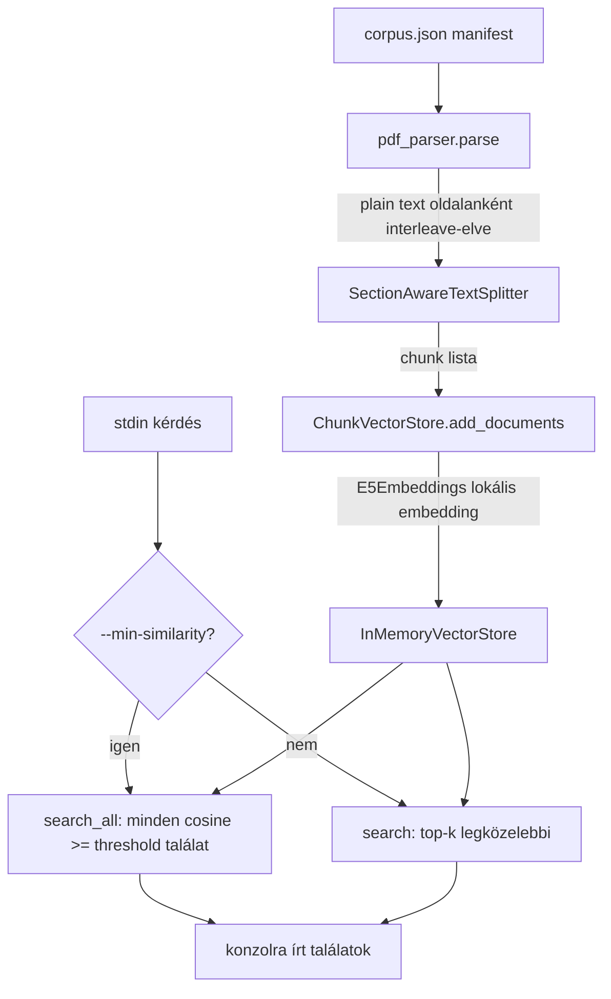

# Mini RAG Pipeline — fejlesztői dokumentáció

Ez a dokumentum a `mini-rag` implementáció belső felépítését, a főbb
tervezési döntéseket és a köztük lévő trade-off-okat mutatja be. A
felhasználói szempontú leírásért (futtatás, paraméterek) lásd a
[README.md](README.md) fájlt.

## Áttekintés

A pipeline négy fő lépésből áll, amit a `mini_rag.main` CLI orchestrál:

```
corpus.json manifest
        │
        ▼
 pdf_parser.parse()       — PDF → egy darab plain-text (táblázat-tudatos)
        │
        ▼
 SectionAwareTextSplitter — plain-text → retrieval-méretű chunk-ok
        │
        ▼
 ChunkVectorStore         — chunk-ok → lokális embedding + in-memory vektortár
        │
        ▼
 interaktív query loop    — stdin kérdés → top-k / min-similarity találatok
```

Minden futtatás a `corpus.json`-ban felsorolt teljes dokumentumhalmazt
újra feldolgozza és beágyazza; nincs perzisztens adatbázis vagy inkrementális
frissítés — ez a "frissüljön a DB" követelményt a legegyszerűbb módon
teljesíti, cserébe minden indítás néhány perces PDF-feldolgozási és
embedding-számítási költséggel jár (lásd az "Trade-off-ok" szakaszt).

## Modulok

### `mini_rag/main.py` — CLI belépési pont

- Beolvassa a `corpus.json` manifestet, minden dokumentumra lefuttatja a
  parse+chunk lépéseket (`run()` függvény), majd az összes chunkot egyetlen
  `ChunkVectorStore`-ba tölti.
- Ezután egy `while True` ciklusban stdin-ről olvas kérdéseket, amíg a
  felhasználó `exit`-et nem ír be vagy EOF nem érkezik.
- Kérdésenként vagy `chunk_store.search()` (top-k), vagy
  `chunk_store.search_all()` (min-similarity szűrés) hívódik meg, az alapján,
  hogy a `--min-similarity` CLI kapcsoló meg van-e adva.
- A relatív `inputFile` útvonalakat a manifest saját könyvtárához képest
  oldja fel (`_resolve_input_file`), hogy a `corpus/` könyvtár (manifest +
  PDF-ek) együtt szabadon áthelyezhető/telepíthető legyen.

### `mini_rag/pdf_parser.py` — PDF → szöveg

A `pdfplumber` sima `page.extract_text()`-je táblázatoknál összekeveri az
oszlopokat, ezért a modul oldalanként két külön utat követ, majd egyesíti
őket olvasási sorrendben:

1. **Táblázatok**: `page.find_tables()` + `.extract()`, majd
   `"cella | cella | ..."` formátumú sorokká szerializálva
   (`_serialize_table`), hogy a sor/oszlop struktúra megmaradjon.
2. **Prózai szöveg**: a táblázatok bounding box-ait kivágva
   (`page.outside_bbox`) a maradék szöveg soronként kerül kiszedésre, hogy a
   táblázat-tartalom ne duplikálódjon.
3. A két forrásból származó szegmensek a `top` (Y-koordináta) szerint vannak
   rendezve, hogy az eredeti, fentről lefelé olvasási sorrend megmaradjon.
4. A `footer_line_patterns`-nek megfelelő sorok (pl. oldalszám, "Utolsó
   módosítás:") minden oldalon eltávolításra kerülnek; a `skip_pages`-ben
   felsorolt oldalak (pl. borító, tartalomjegyzék) teljesen kimaradnak.

### `mini_rag/text_splitter.py` — szöveg → chunk-ok

A `SectionAwareTextSplitter` két menetben darabol:

1. **Szakasz-határ** (`RecursiveCharacterTextSplitter`): kizárólag a
   számozott szakaszcím-mintákra vág (`"1. "`, `"1.1. "`, `"1.1.1. "`,
   `"1.1.1.1. "`, minden szint saját regex szeparátorral), fallback
   szeparátor nélkül. Egy kis `chunk_size`-ot (`_MIN_SECTION_TOKENS = 96`)
   használva a rövid szakaszok (pl. csak egy cím vagy egy mondat) a
   következő azonos szintű testvér-szakasszal összevonásra kerülnek, hogy ne
   maradjanak önálló, alig informatív mini-chunk-ok; a `_MIN_SECTION_TOKENS`
   fölötti szakaszok önálló egységként maradnak.
2. **Test-darabolás** (`CharacterTextSplitter`): csak azok a
   szakasz-egységek kerülnek ide, amelyek a valódi `chunk_size`-nál
   nagyobbak. Egyetlen, lapos szeparátor-szintet használ (nincs
   rekurzió), így a `chunk_overlap` konzisztensen érvényesül minden
   al-chunk között — egy többszintű rekurzív splitter minden rekurziós
   lépésnél új buffer-t kezdene, elveszítve az átfedést a szintek határán.

A `chunk_size` és a `_MIN_SECTION_TOKENS` az
embedding modell (`intfloat/multilingual-e5-base`) saját tokenizálójával
mért **token**-ekben van megadva, nem karakterben, mert az E5 modellek egy
fix (512 token-es) input-korlátnál csonkolnak. Karakter alapú méretezés
csendben engedhetne át 512 tokennél hosszabb vagy token-sűrűbb szöveget,
amit az embedding modell észrevétlenül levágna.

A `_MIN_SECTION_TOKENS = 96` értéket a korpusz saját token-hossz eloszlásából
választottuk: kényelmesen a "cím vagy egy rövid mondat" (~50 token) sáv
fölött, jóval a ~170 token-es medián szakaszméret alatt, hogy csak a
ténylegesen apró szakaszok kerüljenek összevonásra.

### `mini_rag/embedder.py` — beágyazás + vektortár

- **Modell**: `intfloat/multilingual-e5-base` (`sentence-transformers`
  révén, `langchain-huggingface`-en keresztül), teljesen lokálisan fut, nincs
  külső API-hívás vagy API kulcs.
- **`E5Embeddings`**: az E5 modellcsalád aszimmetrikus tanítást használ —
  kérdéseket `"query: "`, dokumentum-chunk-okat `"passage: "` prefixszel kell
  ellátni ahhoz, hogy a modell meg tudja különböztetni a két szerepet. Ezt a
  `HuggingFaceEmbeddings` subclass-olásával elvégzi.
- **`ChunkVectorStore`**: egy LangChain `InMemoryVectorStore`-t csomagol be.
  Két keresési mód érhető el:
  - `search(query, k)`: a `k` legközelebbi chunk (top-k).
  - `search_all(query, min_similarity)`: **ez implementálja a feladat azon
    követelményét, hogy egy cosine metrikát támogató kollekció esetén
    minden találatot vissza lehessen adni, nem csak a top X-et** — az
    `InMemoryVectorStore` mindig koszinusz hasonlóság szerint rangsorol,
    ezért minden tárolt chunk pontszámát kiszámítva és a küszöbérték szerint
    szűrve megkapható minden releváns találat, korlátozás nélkül.


## Adatfolyam / architektúra diagram



## Ismert korlátok / jövőbeli fejlesztési lehetőségek

- **Nincs perzisztencia**: minden futtatás újra parse-olja és beágyazza a
  teljes korpuszt.
- **Egyetlen embedding modell**: nincs lehetőség modellváltásra CLI
  paraméterrel.
- **Nincs re-ranking vagy hybrid (BM25 + vektor) keresés**: a keresés
  kizárólag cosine hasonlóságon alapul.
